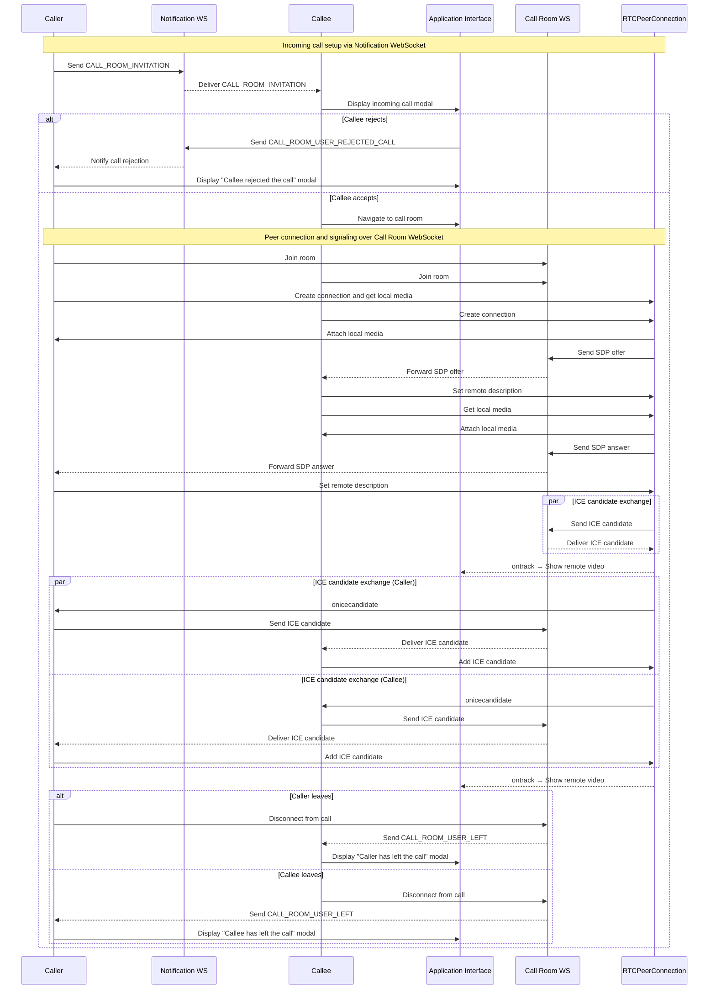
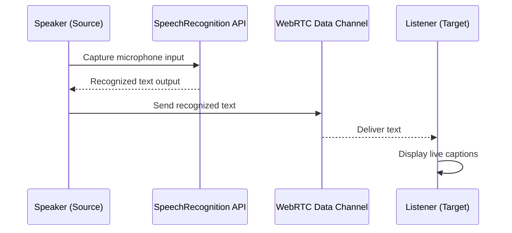
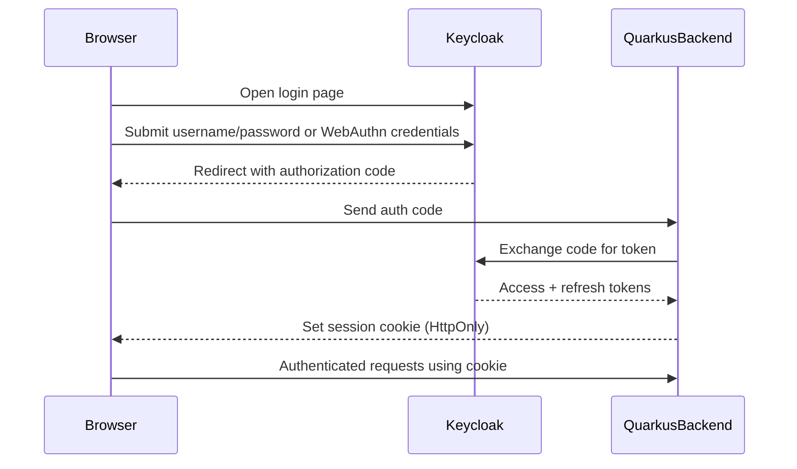
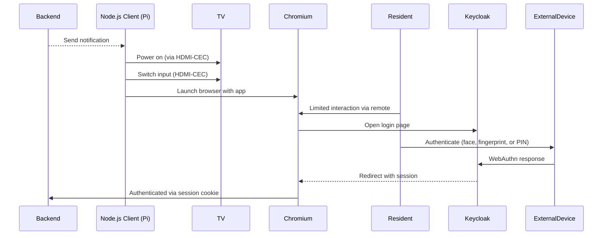
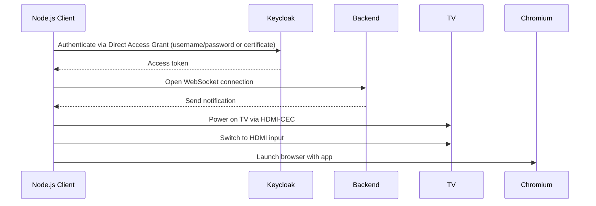

## Call initiation and Web RTC

```mermaid
sequenceDiagram
    participant Caller
    participant Notification WS
    participant Callee
    participant Application Interface
    participant Call Room WS
    participant RTCPeerConnection

    Note over Caller, RTCPeerConnection: Incoming call setup via Notification WebSocket
    Caller->>Notification WS: Send CALL_ROOM_INVITATION
    Notification WS-->>Callee: Deliver CALL_ROOM_INVITATION
    Callee->>Application Interface: Display incoming call modal

    alt Callee rejects
        Application Interface->>Notification WS: Send CALL_ROOM_USER_REJECTED_CALL
        Notification WS-->>Caller: Notify call rejection
        Caller->>Application Interface: Display "Callee rejected the call" modal
    else Callee accepts
        Callee->>Application Interface: Navigate to call room

        Note over Caller, RTCPeerConnection: Peer connection and signaling over Call Room WebSocket
        Caller->>Call Room WS: Join room
        Callee->>Call Room WS: Join room
        Caller->>RTCPeerConnection: Create connection and get local media
        Callee->>RTCPeerConnection: Create connection

        RTCPeerConnection->>Caller: Attach local media
        RTCPeerConnection->>Call Room WS: Send SDP offer
        Call Room WS-->>Callee: Forward SDP offer
        Callee->>RTCPeerConnection: Set remote description
        Callee->>RTCPeerConnection: Get local media
        RTCPeerConnection->>Callee: Attach local media
        RTCPeerConnection->>Call Room WS: Send SDP answer
        Call Room WS-->>Caller: Forward SDP answer
        Caller->>RTCPeerConnection: Set remote description

        par ICE candidate exchange
            RTCPeerConnection->>Call Room WS: Send ICE candidate
            Call Room WS-->>RTCPeerConnection: Deliver ICE candidate
        end

        RTCPeerConnection-->>Application Interface: ontrack → Show remote video

        par ICE candidate exchange (Caller)
            RTCPeerConnection->>Caller: onicecandidate
            Caller->>Call Room WS: Send ICE candidate
            Call Room WS-->>Callee: Deliver ICE candidate
            Callee->>RTCPeerConnection: Add ICE candidate
        and ICE candidate exchange (Callee)
            RTCPeerConnection->>Callee: onicecandidate
            Callee->>Call Room WS: Send ICE candidate
            Call Room WS-->>Caller: Deliver ICE candidate
            Caller->>RTCPeerConnection: Add ICE candidate
        end

        RTCPeerConnection-->>Application Interface: ontrack → Show remote video

        alt Caller leaves
            Caller->>Call Room WS: Disconnect from call
            Call Room WS-->>Callee: Send CALL_ROOM_USER_LEFT
            Callee->>Application Interface: Display "Caller has left the call" modal
        else Callee leaves
            Callee->>Call Room WS: Disconnect from call
            Call Room WS-->>Caller: Send CALL_ROOM_USER_LEFT
            Caller->>Application Interface: Display "Callee has left the call" modal
        end
    end
```

## Captions and WebRTC

```mermaid
sequenceDiagram
    participant Speaker as Speaker (Source)
    participant SpeechRecognition as SpeechRecognition API
    participant DataChannel as WebRTC Data Channel
    participant Listener as Listener (Target)

    Speaker->>SpeechRecognition: Capture microphone input
    SpeechRecognition-->>Speaker: Recognized text output

    Speaker->>DataChannel: Send recognized text
    DataChannel-->>Listener: Deliver text
    Listener->>Listener: Display live captions
```

## External User Login Flow

```mermaid
sequenceDiagram
    participant Browser
    participant Keycloak
    participant QuarkusBackend

    Browser->>Keycloak: Open login page
    Browser->>Keycloak: Submit username/password or WebAuthn credentials
    Keycloak-->>Browser: Redirect with authorization code
    Browser->>QuarkusBackend: Send auth code
    QuarkusBackend->>Keycloak: Exchange code for token
    Keycloak-->>QuarkusBackend: Access + refresh tokens
    QuarkusBackend-->>Browser: Set session cookie (HttpOnly)
    Browser->>QuarkusBackend: Authenticated requests using cookie
```

## Internal User Flow (Resident via Raspberry Pi)

```mermaid
sequenceDiagram
    participant Backend
    participant NodeClient as Node.js Client (Pi)
    participant TV
    participant Chromium
    participant Resident
    participant Keycloak

    Backend-->>NodeClient: Send notification
    NodeClient->>TV: Power on (via HDMI-CEC)
    NodeClient->>TV: Switch input (HDMI-CEC)
    NodeClient->>Chromium: Launch browser with app
    Resident->>Chromium: Limited interaction via remote
    Chromium->>Keycloak: Open login page
    Resident->>ExternalDevice: Authenticate (face, fingerprint, or PIN)
    ExternalDevice->>Keycloak: WebAuthn response
    Keycloak-->>Chromium: Redirect with session
    Chromium->>Backend: Authenticated via session cookie
```

## Client Authentication & Triggering

```mermaid
sequenceDiagram
    participant NodeClient as Node.js Client
    participant Keycloak
    participant Backend
    participant TV
    participant Chromium

    NodeClient->>Keycloak: Authenticate via Direct Access Grant (username/password or certificate)
    Keycloak-->>NodeClient: Access token
    NodeClient->>Backend: Open WebSocket connection
    Backend-->>NodeClient: Send notification
    NodeClient->>TV: Power on TV via HDMI-CEC
    NodeClient->>TV: Switch to HDMI input
    NodeClient->>Chromium: Launch browser with app
```
