## Global use case

```mermaid
graph LR
  %% Define actors
  A1["👵 Nursing Home Resident"]
  A2["🏥 Healthcare Professionals"]
  A3["👩‍⚕️ Nursing Home Staff"]
  A4["👨‍👩‍👧‍👦 Resident Relatives"]

  %% Use cases in the center (vertical list)
  subgraph UseCases [" "]
    direction TB
    U1["📞 Video Call"]
    U2["📺 Automatic TV Activation"]
    U3["🎤 Voice Recognition"]
    U4["🗣️ Text-to-Speech"]
    U5["♿ Accessibility Settings"]
    U6["📋 Contact Management"]
    U7["📢 Information Hub"]
    U8["💊 Healthcare Reminders"]
    U9["🎭 Social Engagement Tools"]
  end

  %% A1 -> Use Cases

  A1 -- Uses --> U2
  A1 -- Uses --> U3
  A1 -- Uses --> U4
  A1 -- Uses --> U5
  A1 -- Manages --> U6
  A1 -- Accesses --> U7
  A1 -- Receives --> U8
  A1 -- Participates --> U9
  A1 -- Uses --> U1

  %% A2 -> Use Cases
  A2 -- Uses --> U1
  A2 -- Provides --> U8


  %% A3 -> Use Cases
  A3 -- Manages --> U5
  A3 -- Manages --> U6
  A3 -- Updates --> U7
  A3 -- Configures --> U8
  A3 -- Supports --> U1

  %% A4 -> Use Cases
  A4 -- Calls --> U1
  A4 -- Manages --> U6
  A4 -- Shares --> U7
```

## Accessibility Settings

The idea is that two different actors can configure the accessibility settings.
Either the Nursing Home Staff or the Resident Tutor (optional) : a resident relatives that can configure the resident settings. This right is given by the Nursing Home Staff.

The accessibility settings consist into 3 different impairments :

- Physical & Psychological : this would impact some functionnalities, such as the possibility to automatically accept calls.
- Visual : any help to improve UI usage of the application
- Auditive : specific audio settings that will be used in call to help resident understanding

All these settings could be define with default profiles, based on use impairements (e.g : colorblind would set a visual accessibility settings), or advanced settings, allowing to directly access the detailed configuration manually

```mermaid
graph LR
  %% Define actors
  A1["👩‍⚕️ Nursing Home Staff"]
  A2["👨‍👩‍👧‍👦 Resident Relatives (Resident Tutor(s))"]

  %% Use cases in the center (vertical list)
  subgraph UseCases [" "]
    direction TB
    U1["♿️ Physical & Psychological Settings"]
    U2["👓 Visual Settings"]
    U3["🔊 Auditory Settings"]
    U4["🧑‍💻 Set Default Accessibility Profiles"]
    U5["🛠️ Set Advanced Accessibility Settings"]
  end

  %% A1 -> Use Cases
  A1 -- Configures --> U1
  A1 -- Configures --> U2
  A1 -- Configures --> U3
  A1 -- Configures --> U4
  A1 -- Configures --> U5

  %% A2 -> Use Cases
  A2 -- Configures --> U1
  A2 -- Configures --> U2
  A2 -- Configures --> U3
  A2 -- Configures --> U4
  A2 -- Configures --> U5
```

## Contact Management

As for the previous version, this process can depend on the resident situation.

If the user is mentally able, it can accept contacts. If not, only his tutor(s) or the nursing home staff can setup his contact.

External users can request contact access (based on the room number)

```mermaid
graph LR
  %% Define actors
  A1["👵 Nursing Home Resident"]
  A2["👩‍⚕️ Internal Nursing Home Staff"]
  A3["👨‍⚕️ External Healthcare Professionals"]
  A4["👩‍👧‍👦 Resident Tutor"]
  A5["🌐 External Users"]

  %% Use cases in the center (vertical list)
  subgraph UseCases [" "]
    direction TB
    U1["📞 Accept Contact"]
    U2["🔑 Manage Contact"]
    U3["📑 Request Contact Access"]
  end

  %% A1 -> Use Cases
  A1 --> U1

  %% A2 -> Use Cases
  A2 --> U1
  A2 --> U2

  %% A3 -> Use Cases
  A3 --> U3

  %% A4 -> Use Cases
  A4 --> U1
  A4 --> U2

  %% A5 -> Use Cases
  A5 --> U3

```

## Video Call

Video Calls cover the usual functionnalities such as :

- Start / end call
- Accept call : this step is optionnal based on the accessibility settings
- Mute yourself
- Disable the camera
- Share screen (only for external users on a compatible device)
  - The idea is for him to be able to share content such as pictures

```mermaid
graph LR
  %% Define actors
  A1["👵 Nursing Home Resident"]
  A2["👨‍👩‍👧‍👦 Resident Contact"]

  %% Use cases in the center (vertical list)
  subgraph UseCases [" "]
    direction TB
    U1["📞 Start / End Call"]
    U2["✅ Accept Call"]
    U3["🔇 Mute Yourself"]
    U4["🎥 Disable Camera"]
    U5["🖥️ Share Screen"]
  end

  %% A1 -> Use Cases
  A1 --> U1
  A1 --> U2
  A1 --> U3
  A1 --> U4

  %% A2 -> Use Cases
  A2 --> U1
  A2 --> U2
  A2 --> U3
  A2 --> U4
  A2 --> U5
```

